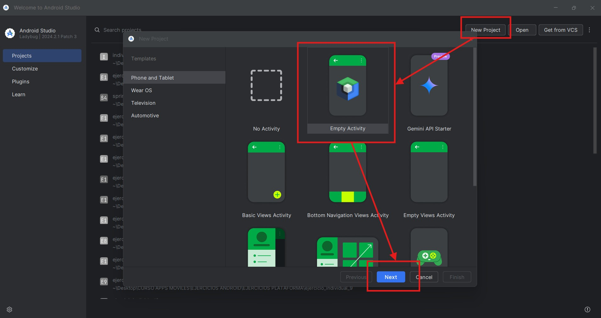
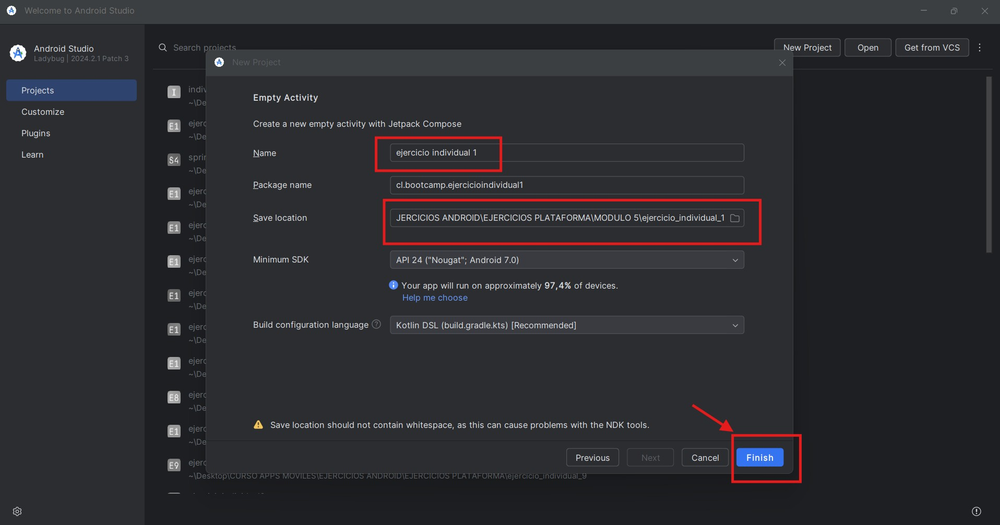
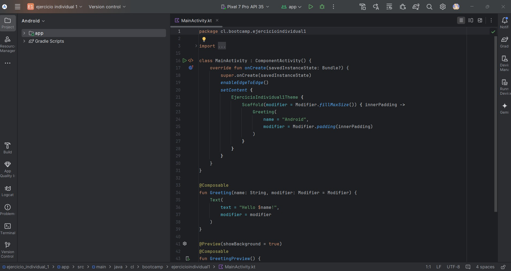
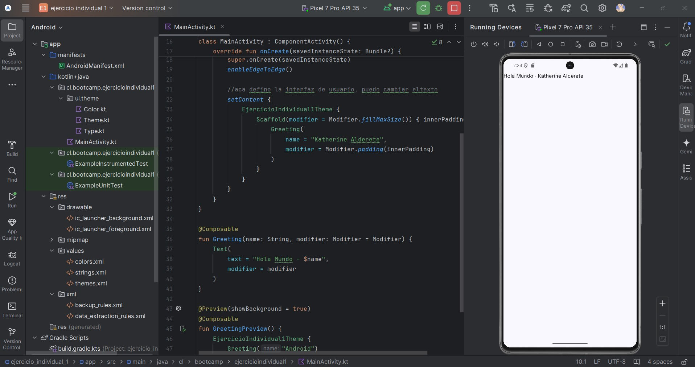

**_<h2 align="center">:vulcan_salute: Ejercicio Individual 1 - Primer Proyecto Kotlin :computer:</h2>_**

Proyecto realizado según los siguientes requerimientos:

## Primer Proyecto en Kotlin.

1. Es importante entender que Kotlin puede funcionar con estructuras .xml sin ningún problema, pero debemos comprender también que actualmente la recomendación de Android es trabajar Kotlin en conjunto con Jetpack Compose.

    - Por esa razón, la primera actividad consiste en __crear un proyecto de Kotlin + Jetpack Compose__, es decir, un Empty Activity.
    - Deben sacar capturas de cada uno de los pasos a seguir para crear el nuevo proyecto.
    - Adjuntarán las capturas en una carpeta y dentro también crearán un .txt respondiendo un par de preguntas relacionadas al nuevo ActivityMain.
	    - **¿Qué te llama la atención del nuevo ActivityMain.kt?**
	    - **¿Logras visualizar alguna función o estructura que se parezca a las que teníamos en el ActivityMain.class?**

2. Realiza un pequeño cambio en el __Texto principal__, agrega un _"Hola Mundo - Tu Nombre"_.
3. Ejecuta la aplicación en el emulador y __saca una captura__ de como se visualiza tu primer Hola Mundo en Kotlin + Jetpack Compose.

